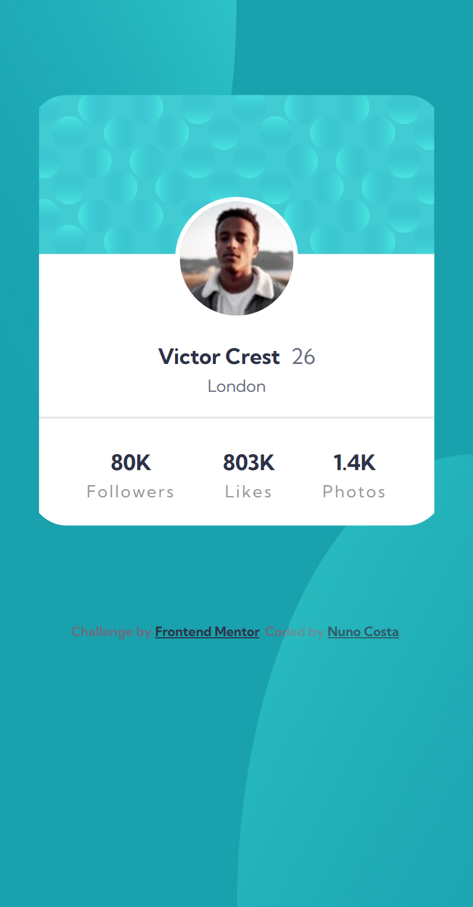

# Frontend Mentor - Profile card component solution

This is a solution to the [Profile card component challenge on Frontend Mentor](https://www.frontendmentor.io/challenges/profile-card-component-cfArpWshJ). Frontend Mentor challenges help you improve your coding skills by building realistic projects.

## Table of contents

- [Overview](#overview)
  - [The challenge](#the-challenge)
  - [Screenshot](#screenshot)
  - [Links](#links)
- [My process](#my-process)
  - [Built with](#built-with)
  - [What I learned](#what-i-learned)
  - [Useful resources](#useful-resources)
- [Author](#author)

## Overview

### The challenge

- Build out the project to the designs provided

### Screenshot

<h4 align="center"><strong>Mobile/Desktop Design</strong></h4>

<p align="center">


### Links

- Solution URL: [Solution URL](https://www.frontendmentor.io/solutions/profile-card-challenge-htmlcss-8DDnhzhZSG)
- Live Site URL: [Live site URL](https://profile-card-component-challenge-sepia.vercel.app/)

## My process

### Built with

- Semantic HTML5 markup
- CSS custom properties
- Flexbox

### What I learned

This project was pretty simple but I learned the translate() property which was very useful to setup the background of the web page.

```html
.bg-top {
  position: absolute;
  top: 0;
  left: 0;
  <!-- place image on the top left of its current position -->
  transform: translate(-50%, -50%);
  width: 100%;
  height: 100%;
}

.bg-bottom {
  position: absolute;
  right: 0;
  bottom: 0;
  <!-- place image on the bottom right of its current position -->
  transform: translate(50%, 50%);
  width: 100%;
  height: 100%;
}
```

### Useful resources

- [Translate property](https://developer.mozilla.org/en-US/docs/Web/CSS/transform-function/translate) - This helped me understand the translate() property.

## Author

- Frontend Mentor - [@Bottom17](https://www.frontendmentor.io/profile/Bottom17)
